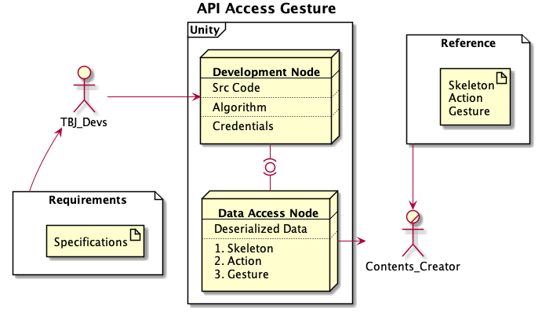

# Development Targets and Milestones

### [2021-08-17]

- [x] TBA Design Documentation Sharing (Weekly Meeting)

### [2021-08-18]

- [ ] ★ConnectedSeatApiGesture Connection Testing
- [x] TBA Gesture Data Testing
- [ ] TBA Gesture Data Deserialization
- [ ] Gesture Data to ConnectedSeatApiGesture
- [ ] How to Access ConnectedSeatApiGesture

### [2021-08-24]

- [ ] Create Gesture Data Sheet / (Data Structure) Table for Contents Maker Reference

  

- [ ] ★Confirm Contents Maker can access API Gesture Data

### [2021-08-25]

- [ ] Unity <-> Gesture Initial Functionality Test (Low Accuracy)
- [ ] Collect Experiment Data for TBA Development 

### [2021-08-27]

- [ ] Share Data to TBA for Algorithm Update

### [2021-08-31]

- [ ] Data Analysis Request for Gesture Recognition.

- [ ] ★Confirm Improved Gestures