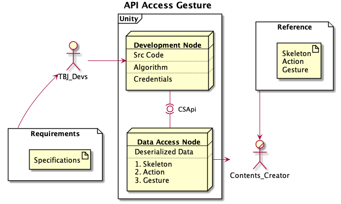

# Development Targets and Milestones

### [2021-08-17]

- [x] TBA Design Documentation Sharing (Weekly Meeting)

  > - Will wait for further instructions and will work on discussions on business use-cases for CES preparation.
  > - Shared shanghai motor show temperature device shipping cost. $1200(8000 Yuan)


### [2021-08-18]

- [x] ★ConnectedSeatApiGesture Connection Testing[Local Only - not via Control PC]

- [x] TBA Gesture Data Testing

  > - If python based direction is difficult to implement, directional data will be implemented in Unity C#
  > - Python based status are much better since it does not use windows[deques].

- [ ] TBA Gesture Data Deserialization

  > Confirm existing data deserialization first.

- [x] Gesture Data to ConnectedSeatApiGesture

- [x] How to Access ConnectedSeatApiGesture

  > Issue encountered, system is stopping when operating with two Azure Kinects set to 30fps.
  >
  > maximum is 15fps per azure kinect.


### [2021-08-19]

- [x] Provide Feedback to TBA about Gesture Shared [2021-08-17]

  - Test and Improve Direction of Shuriken and Push with updated config files(from TBJ)

  > TBA will continue developing the gesture directions using the Data Structure and temporary coordinates provided by TBJ.


- [x] Short meeting with Nick to get status update

  > TBA started business use-case discussion for CES2021 presentation
  >
  > TBA Nick Papa and Nick Flannery are exploring the shanghai motor show for modification feasibility.
  >
  > - TBA capability to modify contents

### [2021-08-20]

- [ ] Receive Updated Gesture from TBA [TBA Time]
- [x] Send Feedback information to TBA(TBA will continue development using feedback)


### [2021-08-24]

- [ ] Create Gesture Data Sheet / (Data Structure) Table for Contents Maker Reference

  

- [ ] ★Confirm Contents Maker can access API Gesture Data

### [2021-08-27]

- [ ] Share Data to TBA for Algorithm Update
- [ ] Unity <-> Gesture Initial Functionality Test (Low Accuracy)
- [ ] Collect Experiment Data for TBA Development 

### [2021-08-31]

- [ ] Data Analysis Request for Gesture Recognition.
- [ ] ★Confirm Improved Gestures


-----

Issues:

- Final Calibrated Gesture requires final calibration json.

  > TBA and TBJ will temporary develop with similar environment
  >
  > the update the final implementation of gesture after the calibration json is finished.
  >
  > minor recalibration and config file adjustment is necessary.


I/O Data in Repository.

Docker

Azure_kinect

-cs_eye_line(empty)

-cs_sitting_seat

-cs_detect_gesture

OS

RoS2 distro

ICP Repo source code

-json creation


Rosbag file


Upcomming Support from:

NTT ->C++;

Fujitsu ->


#### TBJ Conditions:

- Business Trip conditions became more strict due to increase in COVID19 cases
- Aichi Prefecture (state of emergency) - avoid outside prefecture trips.


#### Gesture Development

Repository for gesture branch

```
https://github.com/DonnaldBelen/FY2021_CS-toyota-boshoku.git
```

- Pointer Gesture
  - Just output display (coordinate on screen).
  - contents creator will overlay a pointer on the screen.


##### Others:

1. Nuralogix

   - TBJ side has no update regarding the on-going research and development of new RRi device and/or algorithm.

2. Lumepad / Tanvas

3. motion gesture

   - Currently available in Japan through Cornes Technologies Inc,.

     Request for TBA to check their availability in the US and attendance to CES


##### CES Items

1. Business Use-cases
2. Invitation (Will be coordinated with Sato-san's team)
3. Booth location and layout (for discussion on succeeding meetings)
4. Week 36 meeting might be converted to monthly(for confirmation with Kitagawa-san)